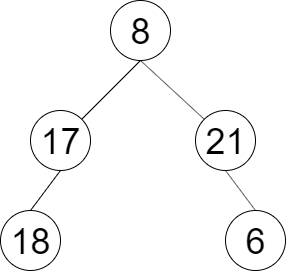

# 题目 - 彩灯装饰记录3

## 题目描述

一棵圣诞树记作根节点为 root 的二叉树，节点值为该位置装饰彩灯的颜色编号。请按照如下规则记录彩灯装饰结果：

第一层按照从左到右的顺序记录
除第一层外每一层的记录顺序均与上一层相反。即第一层为从左到右，第二层为从右到左。

```java
public class TreeNode {
      int val;
      TreeNode left;
      TreeNode right;
      TreeNode() {}
      TreeNode(int val) { this.val = val; }
      TreeNode(int val, TreeNode left, TreeNode right) {
          this.val = val;
          this.left = left;
          this.right = right;
      }
}
```

* 示例



* 输入：root = `[8,17,21,18,null,null,6]`
* 输出：`[[8],[21,17],[18,6]]`

## 题解

在正常的bfs的基础上，通过记录每个节点的所在层数，使得同一层里的节点能够被记录在同一个list中，同时通过层数的奇偶性来判断应该反向插入与否

```java
class Solution {
    static class DecoratedNode extends TreeNode {
        int index;

        public DecoratedNode(TreeNode node, int index){
            super(node.val,node.left,node.right);
            this.index = index;
        }
    }

    public List<List<Integer>> decorateRecord(TreeNode root) {
        List<List<Integer>> res = new ArrayList<>();
        if(root == null) return res;
        Queue<DecoratedNode> queue = new LinkedList<>();
        //index从0开始计数，可以直接和res中各个层的list的index对应
        queue.offer(new DecoratedNode(root,0));
        while(!queue.isEmpty()){
            DecoratedNode current = queue.poll();
            if(current.index != res.size()-1){
                res.add(new LinkedList<>());
            }
            if(current.index % 2 == 0){
                res.get(res.size()-1).addLast(current.val);
            }else{
                res.get(res.size()-1).addFirst(current.val);
            }
            //使用current.left或current.right创建新的DecoratedNode就代表必然是新的一层
            if(current.left != null) queue.offer(new DecoratedNode(current.left, current.index+1));
            if(current.right != null) queue.offer(new DecoratedNode(current.right, current.index+1));
        }
        return res;
    }
}
```